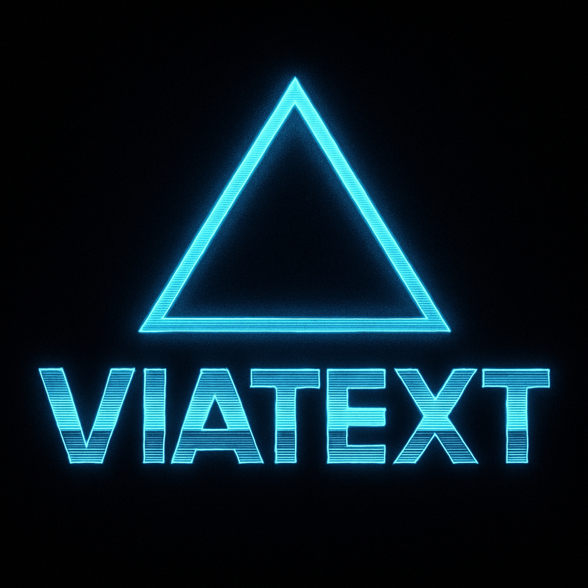

# viatext-ttgo-lora32-v21

*The front line on the wire. The physical node in your hand.*



This is the firmware and configuration package for ViaText-compatible [https://lilygo.cc/products/lora3](**TTGO LoRa32 V2.1**) boards.  
It transforms a low-cost ESP32 device into a resilient, autonomous communication node — part of a text-first mesh that doesn’t rely on the cloud, smartphones, or traditional infrastructure.

This repo runs on **PlatformIO**, targeting the ESP32/LoRa chipset with a focus on durability, transparency, and full Linux-side compatibility via serial links.

---

## 🌐 Role in the System

`viatext-ttgo-lora32-v21` acts as a **node** in the ViaText mesh.  
It sends, receives, and relays human-readable packets using the LoRa radio band, optionally augmented by GPS, OLED display, and battery status monitoring.

Each node:
- Runs a **lightweight C++ firmware**
- Reads/writes packets over LoRa
- Interfaces with Linux hosts via USB serial (`/dev/ttyUSB*`)
- Optionally runs headless or with display feedback

---

## 🔌 PlatformIO Setup

This project is designed for **PlatformIO**, which handles toolchain, libraries, and device upload.

### 📁 Structure

```
viatext-ttgo-lora32-v21/
├── src/
│   ├── main.cpp
│   ├── vtcore-test.ino
│   └── vt-print.hpp
├── include/
│   └── viatext/
│       ├── vtcore.hpp
│       └── vt-utils.hpp
├── lib/
│   └── textbridge/  (optional translators like Morse, JSON, etc.)
├── platformio.ini
└── README.md
```

### 🛠️ Dependencies

- `platformio.ini` targets `esp32dev` with the `ttgo-lora32-v21` board mapping
- Uses:
  - `LoRa.h` (SX1276 radio)
  - `HardwareSerial` for USB comms
  - Optional: `Wire.h`, `U8g2lib`, `TinyGPS++`, `SPI.h`

---

## 📦 Project Goals

- 🔹 Provide a **working ViaText node** for field testing
- 🔹 Serve as **reference firmware** for future board support (e.g. Heltec, RAK)
- 🔹 Allow fully-offline operation and durable delivery
- 🔹 Support relay behavior via simple forwarding logic
- 🔹 Stay **entirely compatible with `viatext-core`**

---

## 📡 T3 Class Tech?

Yes. Compared to legacy packet radio or minimalist UART, this is "T3 Tech" — modular, expressive, and high-capability.  
But ViaText's heartbeat remains simple: **just text, wrapped clean.** The node simply carries it.

---

## 🧪 Test & Upload

```bash
pio run -e ttgo-lora32-v21
pio run -e ttgo-lora32-v21 -t upload
pio device monitor -b 115200
```

USB-serial console should show logs and stamp parsing.  
Configure `/dev/ttyUSB0` access on Linux as needed (`sudo usermod -a -G dialout $USER`).

---

## 🧭 Future Features

- OLED UI modes (debug / delivery / sleep)
- Long-range test modes
- Routing table cache
- Time sync pulse support (`vt-heartbeat` integration)
- SD card packet store/forward
- GPS stamping (optional)

---

## 🤖 Note on AI Assistance

Parts of this README and supporting scaffolds were created with assistance from **ChatGPT** and **GitHub Copilot** to speed up drafting and formatting.

All logic, architectural decisions, and debugging are carried out by a human developer.  
AI tools support the process — they don't lead it.

ViaText is built to be human-readable and machine-compatible. That includes its documentation.
